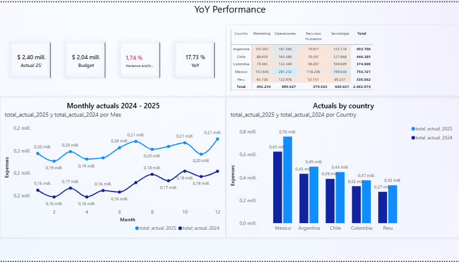
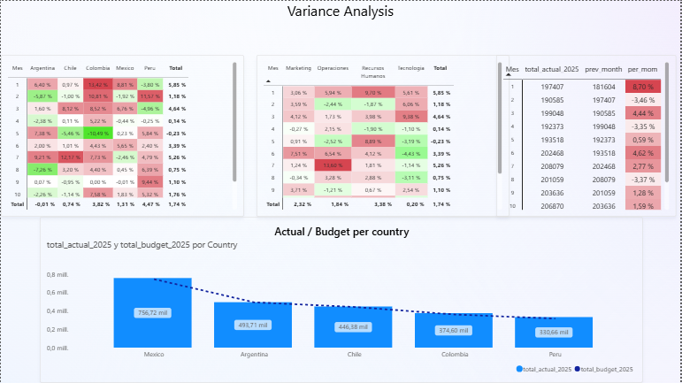

# FP&A Variance Dashboard — Power BI

Interactive Power BI dashboard for multi-country expense analysis (Actual vs. Budget), built on a star schema data model with DAX time intelligence, variance analysis, and automated data quality checks.

This is the third piece of a three-project portfolio applying the same synthetic FP&A dataset across SQL, Python, and Power BI:
- 🔗 [SQL project](https://github.com/julianissidoro/fpa-variance-analysis) — BigQuery variance analysis
- 🔗 [Python project](https://github.com/julianissidoro/fpa-variance-analysis-python) — automated reporting pipeline
- 📊 **This project** — Power BI interactive dashboard

## Overview

The dashboard analyzes expense data across 5 LATAM countries, 4 departments, and 24 months (2024–2025), comparing Actual spend against Budget to surface variance, trend, and month-over-month movement — the kind of reporting an FP&A team reviews monthly.

**Dataset:** synthetic, built for portfolio purposes (960 rows: 5 countries × 4 departments × 12 months × 2 years × Actual/Budget).

## Pages

**1. Summary — YoY Trend**
KPI cards (Actual, Budget, Variance, YoY — anchored to 2025 vs. 2024), monthly trend by year, expense concentration by country/department, and Actual vs. Budget comparison by country.

**2. Actuals Variance — Analysis**
Variance ranking by department, month-over-month variance by country and department, with conditional-formatted heatmaps to spot deviations at a glance.

**3. Data Quality**
Automated audit measure that flags any country/department/month combination with an incomplete Actual/Budget pair — a data integrity check before the report goes out.

## Data model

Star schema: one fact table (`fact_expenses`, long/unpivoted format — one row per Actual or Budget entry, not two columns side by side) related to four dimension tables (`dim_country`, `dim_department`, `dim_type`, and a calculated `Dim_Calendario` date table marked for time intelligence).

## Key DAX techniques

- `CALCULATE()` + `REMOVEFILTERS()` — measures that stay accurate regardless of active slicers
- `DIVIDE()` with explicit `BLANK()` handling — prevents misleading 0% or error values when a denominator is missing
- `TOTALYTD()`, `SAMEPERIODLASTYEAR()`, `PREVIOUSMONTH()` — time intelligence over a properly marked date table
- `RANKX()` — dynamic ranking of departments by variance
- `SUMMARIZE()` + `ADDCOLUMNS()` + `COUNTROWS()` — row-level data quality audit
- `COALESCE()` — guards against silent `BLANK()` propagation in aggregate measures

## Files in this repo

| File | Description |
|---|---|
| `fpa_variance_dashboard.pbix` | Full Power BI file — open in Power BI Desktop (free) to explore the model and DAX measures |
| `fpa_variance_dashboard.pdf` | Static export of all report pages — no software required to view |
| `/screenshots` | Preview images of the dashboard |

## Preview

**Summary — YoY Trend**

**Actuals Variance**

## Tools

Power BI Desktop · DAX · Power Query (M) · Star schema data modeling

## Author

Julian — Finance Business Partner, 10+ years in FP&A and multi-country financial consolidation, upskilling in data analytics (SQL, Python, Power BI).
